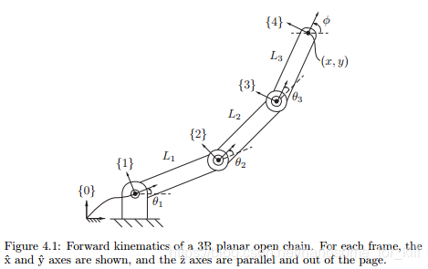
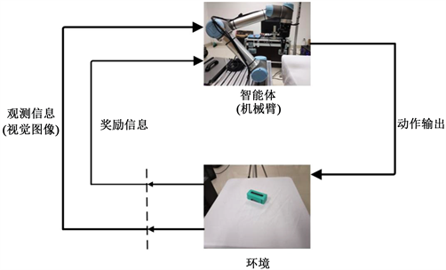
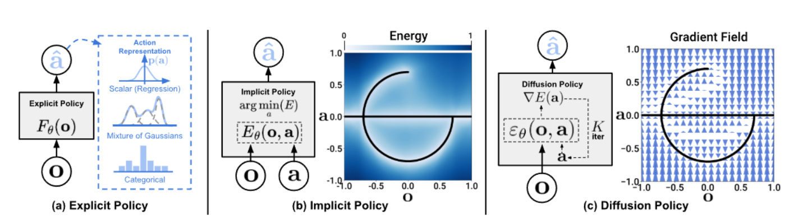
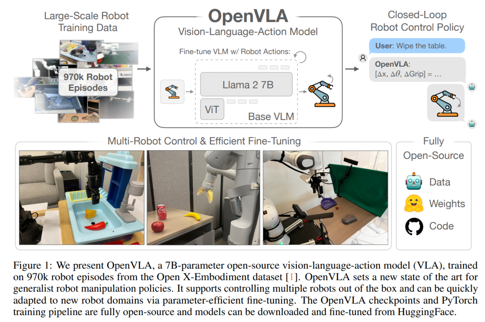
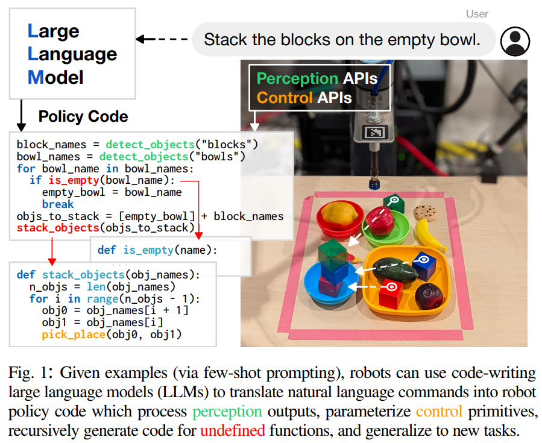
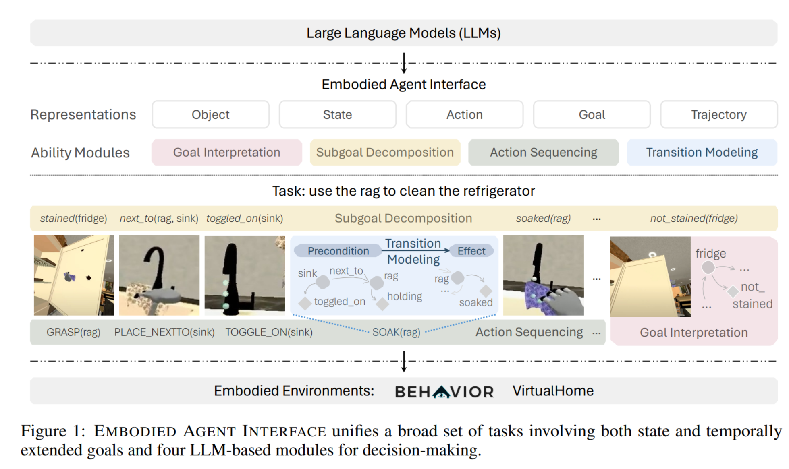
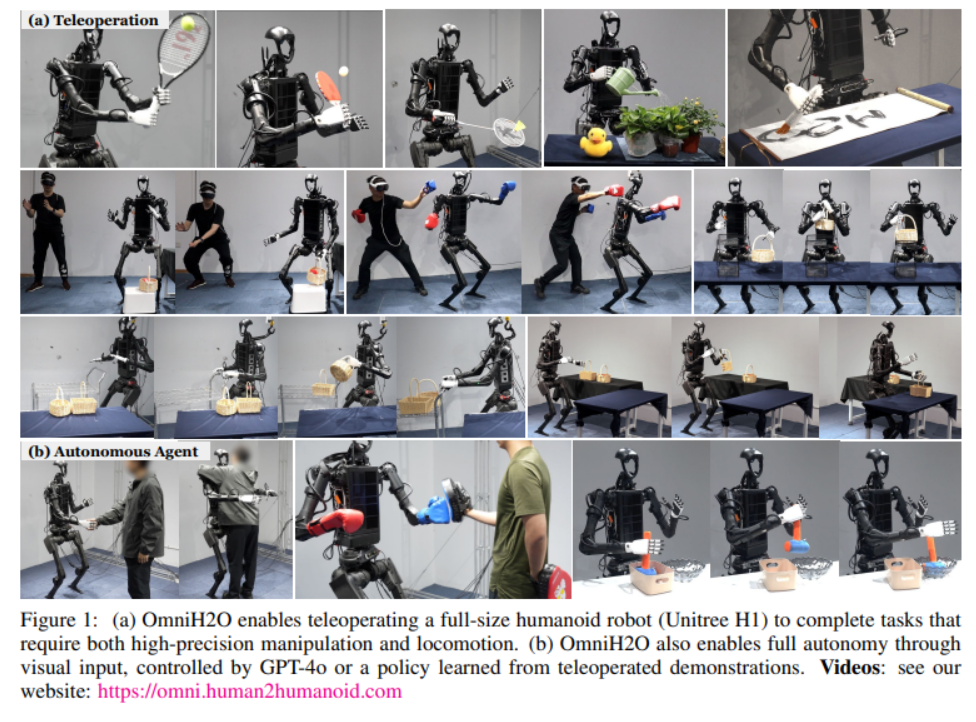

# EI-Beginner 具身智能入门练习

[中文版本](./README.md) | [English Version](./README_EN.md)

有意报考/参与[OpenMOSS实验室](https://openmoss.github.io/)具身智能/人形机器人智能团队的同学，均需先完成下列入门练习。
我们共享出来这个入门练习供广大具身智能/人形机器人智能爱好者作入门参考。

## 入门基础
- 会用ChatGPT/DeepSeek和Google
- 会用Linux
- 会用Git和GitHub
  - https://learngitbranching.js.org/

## 任务一：基于传统运动学的机械臂物体抓取

学习传统机器人学中的基础知识，比如基础坐标变换、正逆运动学、动力学、控制理论等，在PyBullet/Mujoco仿真与实验室机械臂真机（可选, 同时学习机器人操作系统ROS）实现基于传统机器人运动控制的机械臂物体抓取；

备注：
- 参考书目
  - Introduction to Robotics: Mechanics and Control from Stanford
  - Robotic Manipulation from MIT
- PyBullet仿真链接：https://github.com/bulletphysics/bullet3
- Mujoco仿真链接：https://mujoco.org/
- 闯关游戏：https://rcfs.ch/

## 任务二：基于强化学习的机械臂物体抓取

1. 学习强化学习基础知识，并在OpenAI Gym环境中选择几个感兴趣的tasks使用强化学习方法训练并测试成功率；
2. 在PyBullet/Mujoco中训练机械臂的物体抓取策略，并尝试在真机部署，体会Sim2Real的过程；

备注：
- 参考书目
  - 《神经网络与深度学习》相关章节
  - Introduction to Reinforcement Learning, 2nd & David Silver's UCL Course
  - UCB 285 Deep Reinforcement Learning
- OpenAI Gym链接：https://gymnasium.farama.org/index.html

## 任务三：基于模仿学习的机械臂物体抓取

1. 复现模仿学习经典baseline方法Diffusion Policy
   - https://diffusion-policy.cs.columbia.edu
2. 同时学习Huggingface机器人学习框架LeRobot
   - https://github.com/huggingface/lerobot

## 任务四：基于VLA大模型的机械臂物体抓取

学习并利用现有的VLA大模型如OpenVLA/Pi/GR00t等, 探索利用现有的机械臂数据集如Open-X Embodiment训练专门的VLA机械臂模型

备注:
- OpenVLA: https://github.com/openvla/openvla
- Pi: https://github.com/Physical-Intelligence/openpi
- Gr00t: https://github.com/NVIDIA/Isaac-GR00T
- Open-X Embodiment：https://robotics-transformer-x.github.io/
- Large Models: https://stanford-cs336.github.io/spring2025/

## 任务五：基于LLM/VLM大模型的任务规划

- 桌面级任务规划
   - 参考论文 “Code as Policies: Language Model Programs for Embodied Control” （ICRA 2023 Outstanding Paper，https://code-as-policies.github.io/) 在PyBullet仿真与实验室机械臂真机（可选）实现基于视觉模块和大语言模型的机械臂物体抓取；
   - Prompt现有的LLM/VLM来完成这个任务；
   - Finetune现有的LLM/VLM来完成这个任务；

- 场景级任务规划
   - 配置任意一个仿真环境，选择一个模型跑通baseline
   - 设计icl或者cot方法，提高模型具身规划效果
   - （可选）使用对应benchmark提供的训练集，sft模型对比效果

  - 可选仿真环境/benchmark
    - EAI https://github.com/embodied-agent-interface/embodied-agent-interface
    - EmbodiedBench https://github.com/EmbodiedBench/EmbodiedBench
  - 参考论文
    - Embodied Agent Interface: Benchmarking LLMs for Embodied Decision Making https://arxiv.org/pdf/2410.07166
    - VisualAgentBench: Towards Large Multimodal Models as Visual Foundation Agents https://arxiv.org/pdf/2408.06327
    - LLM-Planner: Few-Shot Grounded Planning for Embodied Agents with Large Language Models https://arxiv.org/abs/2212.04088
    - ReAct: Synergizing Reasoning and Acting in Language Models https://arxiv.org/pdf/2210.03629

## 任务六：基于强化学习的人形机器人运动控制

复现OmniH2O: Universal and Dexterous Human-to-Humanoid Whole-Body Teleoperation and Learning (https://omni.human2humanoid.com/) 的人形机器人运动控制方法, 学习人形机器人基础知识, 仿真训练+Sim2Real的过程
1. 全身遥操作
2. 全身模仿学习

参考: 
- Unitree Robotics GitHub: https://github.com/unitreerobotics
- Hover: https://github.com/NVlabs/HOVER
- Underactuated Robotics from MIT

## 前沿研究
- 如何做研究
  - [GAMES003-图形视觉科研基本素养](https://pengsida.net/games003/)
- 会议期刊
  - 机器人：Science Robotics, RSS, CoRL, ICRA, IROS, RLC
  - 机器学习：ICLR, NeurIPS, ICML
  - 计算机视觉：CVPR, ICCV, ECCV
  - 自然语言处理：ACL, EMNLP, COLM
- 在线研讨班
  - CMU Robotics Institute Seminar: https://www.youtube.com/@cmurobotics
  - MIT Robotics Seminar: https://www.youtube.com/@MITRoboticsSeminar
  - MIT Embodied Intelligence Seminar: https://www.youtube.com/@mitembodiedintelligence8675
  - Stanford Seminar: https://www.youtube.com/@stanfordonline

感谢上述相关work开源其代码！